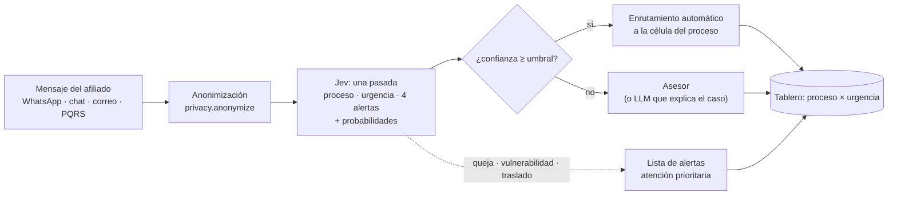

# Caso de uso: modelos "System One" (Jev) en Protección S.A.

> Propuesta del equipo transversal de analítica. Demo ejecutable: `notebooks/08-AGE90-proteccion_triage_jev.ipynb` (datos 100 % sintéticos).
> Las cifras de costo son de lista del proveedor y de nuestras pruebas; las referencias normativas deben validarse con Jurídica y Cumplimiento.

## 1 · Resumen ejecutivo

- Recibimos miles de interacciones de afiliados por muchos canales, sobre procesos muy distintos (vejez, cesantías, traslados, reforma, devoluciones, invalidez/sobrevivencia, certificados, voluntarias). Clasificarlas, priorizarlas y detectar riesgos hoy depende en buena parte de personas y de reglas rígidas.
- **Jev** (TypeSafe AI) es un modelo de nueva generación que **no escribe texto: toma decisiones tipadas** (una opción entre varias, un puntaje, un sí/no) en una sola pasada, **con probabilidades calibradas**. Según el proveedor es mucho más rápido y barato que un LLM para este tipo de decisión.
- La probabilidad calibrada permite **automatizar solo lo que es seguro** y enviar a personas lo dudoso, con un umbral que el líder del área decide y audita.
- Propuesta: **piloto de 6 semanas** en triage de interacciones de servicio, en modo sombra (sin afectar al afiliado), con KPIs de automatización, precisión y tiempo de respuesta. Si funciona, el mismo patrón sirve para calidad de asesoría, tutelas, inversiones y riesgo.

## 2 · Qué es Jev y en qué se diferencia de un LLM

| | LLM (Gemini, Claude, GPT) | Jev (System One) |
|---|---|---|
| Salida | texto (que luego hay que interpretar) | valor tipado: `Choice`, `Score`, `Noul` (probabilidad de "sí") |
| Confianza | no confiable / no calibrada | probabilidades calibradas + `confidence` |
| Velocidad | genera token por token | una sola pasada, todas las preguntas en paralelo |
| Costo | entrada + salida | solo tokens de entrada: USD 0,042 por millón (lista, jev-1.13) |
| Fortaleza | explicar, resumir, redactar | decidir, clasificar, marcar, puntuar a gran escala |
| Límites | costo y latencia a escala | solo texto; mejor en inglés (español menos preciso: **hay que medirlo**); acceso temprano |

La combinación ganadora es **híbrida**: Jev decide rápido y barato sobre el 100 % de los casos, y un LLM (o una persona) explica o resuelve solo los casos dudosos o de alto riesgo.

**Costo ilustrativo:** una interacción típica más las preguntas ronda los 700 tokens. Con Jev, 1 millón de interacciones son unos 700 M tokens, es decir ~**USD 30**. En nuestras pruebas, un LLM ligero (Gemini Flash-Lite) costó ~USD 0,39 por cada 1.000 chats (~USD 390 por millón) y ~USD 0,09 por cada 1.000 mensajes cortos. La demo mide ambos sobre los mismos datos.

## 3 · Caso insignia: triage inteligente de interacciones con afiliados

**Problema.** Los mensajes llegan mezclados; los casos urgentes, de riesgo de queja o de afiliados vulnerables pueden esperar en la misma fila que una consulta de clave. Los reprocesos y reasignaciones cuestan tiempo y experiencia.

**Solución (lo que hace la demo).** Por cada mensaje, Jev responde en una sola llamada:

| Pregunta | Tipo | Uso |
|---|---|---|
| ¿Sobre qué proceso es? (10 procesos, cada uno con su definición) | Choice | enrutar a la célula correcta |
| ¿Qué tan urgente es? (baja / media / alta) | Choice (u ordinal Score) | priorizar la fila |
| ¿Hay riesgo de queja formal (SFC, Defensor, tutela, demanda)? | Noul | escalar antes de que se vuelva queja |
| ¿Pide hablar con una persona? | Noul | evitar frustración con bots |
| ¿Hay señales de vulnerabilidad (adulto mayor, enfermedad, duelo, apuro económico)? | Noul | atención preferente, trato digno |
| ¿Hay intención de irse del fondo? | Noul | alerta temprana a retención |

**Flujo.**

El umbral lo fija el líder del área a partir de la curva automatización vs precisión, y cada decisión queda registrada con su modelo, versión y probabilidad.

**Primeros resultados (demo, 60 mensajes sintéticos, solo línea base LLM `gemini-3.1-flash-lite`).** Proceso (10 clases): **87 % de precisión** (κ 0,85). Riesgo de traslado: 90 %. Riesgo de queja: 88 %. Vulnerabilidad: 87 %. Pide humano: 77 %. **Urgencia: 52 %** (tiende a marcar todo como "alta"), que es justo donde una escala ordinal calibrada (Jev `Score`) y una rúbrica más precisa deben mejorar. Costo LLM: ~USD 0,20 por cada 1.000 mensajes. Falta correr Jev (requiere llave de acceso temprano).

**KPIs para el piloto.**
- % de interacciones enrutadas automáticamente con precisión ≥ 95 % (curva de enrutamiento de la demo).
- Tiempo a primera respuesta en casos de urgencia alta y en afiliados vulnerables.
- Reasignaciones entre células (debería bajar).
- Quejas formales en casos que el sistema marcó con riesgo (detección temprana).
- Costo por interacción clasificada.

## 4 · Banco de ideas por área

Cada idea sigue el mismo patrón: **estado** (el texto o JSON que se evalúa) + **preguntas tipadas** + **umbral de confianza** + **humano en el circuito**. Se ordenan por facilidad de arranque.

| Área | Caso | Preguntas a Jev (ejemplos) | Valor para el líder | Datos necesarios |
|---|---|---|---|---|
| **Servicio y canales** | Triage multicanal (caso insignia) | proceso (Choice), urgencia, riesgo de queja, vulnerabilidad, pide humano (Noul) | filas más cortas, menos reasignaciones | historial de mensajes etiquetado (300–500) |
| **Servicio y canales** | Asistente del asesor en vivo | "¿el afiliado ya dio su documento?", "¿quedó resuelta la duda?" (Noul por turno) | menos tiempo por contacto, siguiente mejor acción | transcripciones de chat |
| **Calidad y cumplimiento de asesoría** | Monitoreo del 100 % de las interacciones en vez de muestras | checklist en Noul: "¿se explicaron los riesgos?", "¿se informó sobre la doble asesoría en un traslado?", "¿hubo promesa indebida de rentabilidad?" | cobertura total de calidad, evidencia para auditoría | transcripciones (voz→texto con `media.py`) + rúbrica del área |
| **Reconocimiento de pensiones (beneficios)** | Pre-revisión de solicitudes | tipo de prestación (Choice), completitud de requisitos declarados (Noul por requisito), complejidad (Score) | priorizar expedientes listos, pedir faltantes al primer contacto | texto de solicitudes / documentos ya digitalizados |
| **Jurídica** | Clasificación de tutelas y derechos de petición | derecho invocado y pretensión (Choice), plazo crítico (Noul), probabilidad de fallo desfavorable (Score, como apoyo) | ningún plazo vencido, reparto al abogado correcto | textos de tutelas/peticiones históricas con su resultado |
| **Inversiones** | Monitoreo de noticias y eventos de emisores | ¿afecta a un emisor del portafolio? (Noul con la lista en el estado), tipo de evento (Choice), severidad (Score), controversia ESG (Noul) | alertas tempranas filtradas, menos ruido para el analista | flujo de noticias + lista de emisores (sin datos de afiliados) |
| **Inversiones** | Etiquetado de informes y comités | tema, postura (positiva/negativa/neutral), riesgo mencionado | búsqueda y trazabilidad de decisiones | documentos internos |
| **Riesgos, SARLAFT y fraude** | Señales en interacciones y medios | suplantación / phishing reportado (Noul), noticia adversa sobre una contraparte (Noul), tipo de riesgo (Choice) | detección temprana, menos falsos positivos | mensajes reportados, noticias |
| **Comercial y retención** | Intención de traslado y oportunidades | intención de irse (Noul), interés en voluntarias o beneficio tributario (Noul), etapa de vida (Choice) | retención proactiva, ofertas pertinentes | interacciones + resultado de retención |
| **Educación financiera / reforma pensional** | Qué preguntan los afiliados sobre la reforma (Ley 2381 de 2024) | tema de la duda (Choice), ¿hay confusión o desinformación? (Noul) | contenidos y guiones basados en dudas reales | mensajes recientes (+ `topics.py` para temas nuevos) |
| **Gestión humana** | Encuestas de clima y comentarios abiertos | tema (Choice), tono (Score), alerta de riesgo psicosocial (Noul) | acción rápida sobre lo que duele | respuestas abiertas (anonimizadas) |
| **Analítica transversal (nuestro equipo)** | Jev como generador de variables | probabilidades de Jev como features para modelos clásicos (churn, NPS, fuga) | modelos más precisos con texto, sin entrenar un LLM | cualquier texto ligado a un evento de negocio |

**Por dónde empezar:** Servicio (volumen y KPI claros), Calidad de asesoría (valor regulatorio visible) e Inversiones/noticias (no requiere datos personales, por lo que el aval de privacidad es más simple).

## 5 · Cómo presentarlo a los líderes (guion de 15 minutos)

1. **El dolor del área** (2 min): una cifra propia de volumen, tiempos o quejas, pedida al líder antes de la reunión.
2. **Demo en vivo** (6 min, notebook 08): mensajes sintéticos → tabla de fila por proceso × urgencia → alertas (queja, vulnerabilidad, traslado) → **curva de enrutamiento**: "con este umbral automatizamos X % con Y % de precisión; el resto lo ve una persona".
3. **Costo y velocidad** (2 min): costo por millón de interacciones y latencia, LLM vs Jev.
4. **Riesgos y cómo se controlan** (3 min): sección 6.
5. **La pregunta al líder** (2 min): "¿Qué decisión repetitiva toma tu equipo cientos de veces al día?" Esa es la siguiente pregunta tipada.

**Preguntas que harán, y respuestas cortas:**
- *¿Reemplaza personas?* No: saca de la fila lo obvio y lleva lo difícil a quien sabe. El umbral lo decide el área.
- *¿Y si se equivoca?* Cada decisión trae su probabilidad; lo dudoso no se automatiza y todo queda registrado (modelo, versión, probabilidad).
- *¿Nuestros datos salen de la compañía?* En la demo no, porque son sintéticos. Para datos reales, anonimización previa y aval de Seguridad, Privacidad y Cumplimiento antes de cualquier envío.
- *¿Funciona en español?* El proveedor indica que su mejor idioma es el inglés. Por eso el piloto **mide** la precisión en nuestro español y compara contra un LLM.

## 6 · Riesgos y gobierno

- **Datos personales:** Ley 1581 de 2012 (Habeas Data) y políticas internas. Empezar con datos sintéticos o anonimizados (`privacy.anonymize`); validar con Seguridad de la Información y Cumplimiento los requisitos de la Superintendencia Financiera sobre servicios en la nube y tercerización. El proveedor declara que no entrena con datos de clientes; la retención cero (ZDR) aplica a planes enterprise (verificar contractualmente).
- **Idioma:** medir en español real. Usar preguntas en inglés con el texto en español y definir cada opción (la demo lo hace).
- **Proveedor en acceso temprano:** límites de uso cambiantes y sin SLA estándar. Fijar la versión del modelo (`jev-1.13.0`) para que los umbrales no se muevan solos, y mantener un LLM de respaldo (el repo permite cambiar de backend sin reescribir la tarea).
- **Equidad y trato a vulnerables:** la marca de vulnerabilidad debe **priorizar**, nunca negar servicio. Revisar periódicamente falsos negativos.
- **Explicabilidad:** probabilidad por decisión, un LLM que explica solo los casos escalados, y muestreo humano mensual (notebook 07: juez validado + revisión humana).

## 7 · Plan de piloto (6 semanas)

| Semana | Entregable |
|---|---|
| 1 | Taxonomía de procesos y urgencias con el dueño del proceso; 300–500 mensajes históricos **anonimizados** etiquetados por el área |
| 2 | Línea base: LLM vs Jev sobre ese set (precisión por campo, calibración, costo); informe en `docs/research.md` |
| 3–4 | Modo sombra: el sistema clasifica en paralelo sin afectar la operación; comparación diaria contra lo que hicieron los asesores |
| 5 | Elección del umbral con el líder (curva automatización vs precisión); definición de escalamientos |
| 6 | Decisión go/no-go con KPIs; si es go, plan de integración con el canal y monitoreo |

**Qué necesitamos de cada líder:** un dueño de proceso con 4 h/semana, acceso a una muestra anonimizada y 2–3 personas del equipo para etiquetar ~2 horas.
