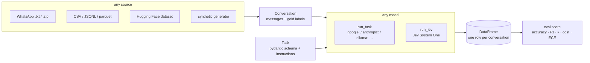

# Walkthrough: using this repo as a data scientist

This repo is a **toolbox and a lab** for turning human data (chats, tickets, surveys, voice notes, images) into typed, measured results with LLMs and other generative models. Use it to answer a question like *"what are our customers saying, and how sure are we?"* on your own data within an afternoon, and to compare techniques with numbers instead of impressions.

- **Toolbox:** `src/genaianalysis/` is a small package you import from notebooks and pipelines.
- **Lab:** `notebooks/` holds one notebook per technique; results go to `docs/research.md`.

---

## 1 · The mental model (read this first)

Everything is built from three ideas. Once you know them, every notebook reads the same way.



1. **`Conversation`** (`schema.py`): a list of `Message(sender, text, timestamp, media)` plus optional gold `labels`. Every source is converted into this.
2. **`Task`** (`schema.py`, examples in `tasks/`): a pydantic output model plus instructions. What you want to extract *is* the schema: `Literal[...]` for categories, `bool` for flags, `str` for free text. Field descriptions matter because they double as the questions for Jev.
3. **Model = a string.** `run_task(task, convs, "google:gemini-flash-lite-latest")`. Swapping to another provider is changing that string. Jev uses `run_jev(task, convs)` and returns the same row shape plus probabilities.

Every backend returns the same columns: `id, task, backend, model, resolved_model, <your fields>, latency_s, input_tokens, output_tokens, cost_usd, error`. A failed item becomes a row with `error` set and never crashes the batch. Results are **cached on disk** per (task, model, input), so re-running a notebook is free.

---

## 2 · Setup (≈5 minutes)

```bash
git clone https://github.com/AGE90/genai-data-analysis.git && cd genai-data-analysis
uv sync                 # Python + deps + dev tools
cp .env.example .env    # add at least GEMINI_API_KEY
uv run pytest           # offline tests, no API calls
```

Keys (all optional except one LLM):

| Variable | Unlocks | Where |
|---|---|---|
| `GEMINI_API_KEY` | Gemini models + embeddings | aistudio.google.com |
| `ANTHROPIC_API_KEY` | Claude models (better judge / generator of a different family) | console.anthropic.com |
| `TYPESAFE_API_KEY` | Jev (notebooks 05, 08) | console.typesafe.ai |

Free-tier Gemini allows ~15 requests/min per model, so the notebooks pass `rpm=12`.

---

## 3 · Where things live

| Path | Open it when you want to… |
|---|---|
| `src/genaianalysis/schema.py` | understand `Conversation`, `Message`, `Task` |
| `src/genaianalysis/run.py` | run a task on many items (concurrency, `rpm`, retries, cache) |
| `src/genaianalysis/eval.py` | score results against gold labels (accuracy, F1, κ, cost, ECE) |
| `src/genaianalysis/ingest/` | load data: `whatsapp.py`, `tabular.py` (CSV/JSONL/parquet), `hf.py`, `synthetic.py` |
| `src/genaianalysis/privacy.py` | pseudonymize senders and redact contact data **before** calling any API |
| `src/genaianalysis/media.py` | turn voice notes / images / documents into text once |
| `src/genaianalysis/topics.py` | unsupervised topics: embed → cluster → name |
| `src/genaianalysis/tasks/` | ready-made tasks: sentiment, topic naming, judges |
| `src/genaianalysis/backends/jev.py` | TypeSafe Jev backend |
| `notebooks/` | the lab (table below) |
| `docs/research.md` | results of every experiment, and the backlog of techniques to try |
| `data/` | raw / processed data and the cache. **Git-ignored**; never commit data |

### The notebooks, in suggested reading order

| # | Notebook | What you learn | Needs |
|---|---|---|---|
| 01 | Gemini API key | raw SDK call, structured output | Gemini |
| 02 | Vertex service account | enterprise auth path | GCP |
| 04 | Model benchmark | compare models on labeled data: the core eval loop | Gemini (+Claude) |
| 03 | WhatsApp → sentiment arc | real chat export → anonymize → task → timeline | Gemini, an export |
| 06 | Topic discovery | embeddings + clustering + LLM names, evaluated | Gemini |
| 07 | LLM-as-judge | grade free text; validate the judge; adjudicate noisy labels | Gemini (+Claude) |
| 05 | Jev vs LLM | calibration, language gap, confidence routing | Jev |
| 08 | Pension-fund triage (use case) | a business-shaped demo of Jev + LLM | Gemini (+Jev) |

Notebook 04 writes the datasets that 05–07 read (`data/processed/*.jsonl`), so run it first.

---

## 4 · Recipes

### Analyze your own free text in ten lines

```python
from typing import Literal
from pydantic import BaseModel, Field
from genaianalysis.schema import Task
from genaianalysis.ingest.tabular import read_table, from_frame
from genaianalysis.privacy import anonymize
from genaianalysis.run import run_task

class Complaint(BaseModel):
    topic: Literal["billing", "delays", "staff", "product", "other"] = Field(description="Main subject of the complaint")
    severity: Literal["low", "medium", "high"] = Field(description="How serious the problem is for the customer")
    summary: str = Field(description="One-sentence summary")

TASK = Task("complaint", Complaint, "Classify customer complaints of a Colombian company.")
convs, _ = anonymize(from_frame(read_table("data/raw/complaints.csv"), text_col="texto", id_col="id"))
results = await run_task(TASK, convs, "google:gemini-flash-lite-latest", rpm=12)  # in a notebook cell
```

### Know how good it is: add labels and score

Label 100–200 items by hand (a CSV column per field), load them as `label_cols`, then:

```python
from genaianalysis.eval import score
score(results, convs, "topic")   # accuracy, macro-F1, κ, coverage, latency, $/1k
```

Try two or three models and a prompt variant; keep whatever wins in `docs/research.md`.

### Compare models

`pd.concat([await run_task(TASK, convs, m, rpm=12) for m in MODELS])` → `score(...)`. One row per model (see notebook 04).

### Use Jev (fast, cheap, calibrated)

Jev answers `Literal` and `bool` fields; free-text fields are skipped. Write field descriptions as clear questions (English works best), and optionally describe each option:

```python
topic: Literal["billing", "delays"] = Field(
    description="Main subject of the complaint",
    json_schema_extra={"criteria": {"billing": "charges, invoices, refunds", "delays": "late deliveries or answers"}},
)
jev = await run_jev(TASK, convs)   # adds topic_confidence, topic_proba
```

Then use `topic_confidence` to automate the confident cases and route the rest to people (notebooks 05 and 08).

### WhatsApp exports

`load_whatsapp("data/raw/whatsapp/chat.zip")` splits by 6h silence into sessions; then `describe_media` (optional; sends media to the provider), then `anonymize(convs, roles={"Company name": "agent"})`. See notebook 03.

### No labels at all?

- **Topics**: `embed → cluster → label_clusters` (notebook 06).
- **Quality of free text**: an LLM judge, validated first with deliberate corruptions (notebook 07).
- **Synthetic labeled data** to prototype the eval before real labels exist (`ingest/synthetic.py`, notebook 08). Treat it as a smoke test, not ground truth.

### Add a new data source or task

- New source → one function in `ingest/` returning `list[Conversation]`.
- New task → a schema + `Task` in `tasks/` (or inline in the notebook until a second notebook needs it).
- New provider → nothing to code if pydantic-ai supports it; otherwise a function returning the standard row shape, using `run.cached_rows` (see `backends/jev.py`).

---

## 5 · Working rules

- **Privacy first.** Run `anonymize` before any API call on real people's data. It is regex-based: names not in the sender list and addresses can slip through, so read a sample. Media is sent raw. Personal data in Colombia falls under Ley 1581 de 2012; get your data-governance area's approval before sending production data to any external API.
- **Measure before you trust.** Every new model/prompt/technique gets a row in `docs/research.md` with n, metrics, cost and caveats.
- **Notebook first, package later.** Code moves into `src/` only when a second notebook needs it.
- **Pin versions when it matters.** Aliases like `gemini-flash-lite-latest` and `jev-latest` move; the `resolved_model` column records what actually answered.

## 6 · Troubleshooting

| Symptom | Cause / fix |
|---|---|
| `429 RESOURCE_EXHAUSTED` | Free-tier quota (per model: ~15/min; 500/day for Flash-Lite, 20/day for `gemini-flash-latest`). Lower `rpm`, switch to another model id (e.g. `gemini-3.1-flash-lite`), wait for the daily reset, or use a paid key |
| `503 UNAVAILABLE` "high demand" | Transient; `with_retries` backs off ~1 min. Re-run: cached items are skipped |
| `404 model … no longer available` | Model retired; use a `-latest` alias or list models (`genai.Client().models.list()`) |
| `ContentFilterError` in `error` | Provider safety block on that item; it stays as an error row |
| Nothing changes after editing a prompt | It did: the cache key includes instructions and schema. If you changed data, check the id |
| pydantic-ai banner in output | `PYDANTIC_AI_NO_BANNER=1` in `.env` |
